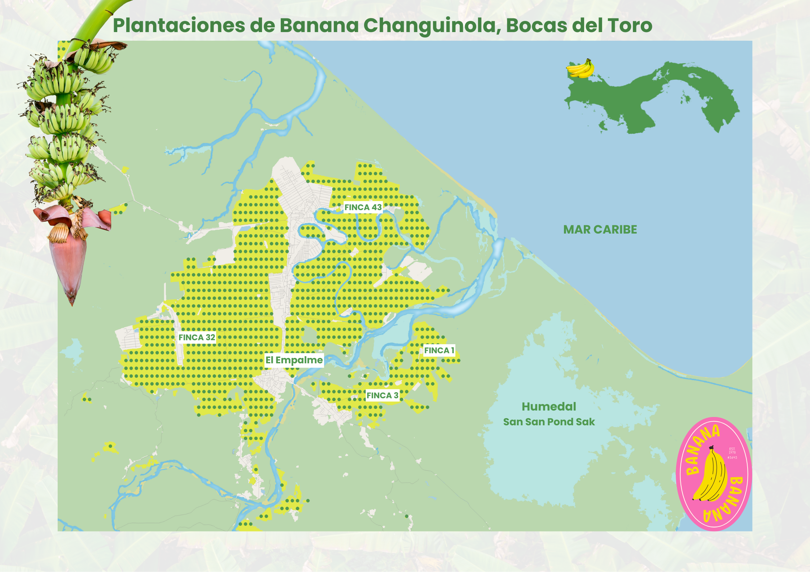

# Spatial Data Science, Water Resources, Climate Change
## Summary
Hi!
I am a Geographer with experience in spatial data science, focusing on water resources management and climate change.

# Map Portfolio
Below is a compilation of selected GIS mapping projects. 

## Banana Plantations in Changuinola, Panama

## Geneva city 3D

## Lake Geneva Bathymetry

## Canopy Height

## City of Leeds 3D

## Panama Population 3D

## Relative Elevation Model River Severn

## Colorful Panama Rivers

## Central America Rainfall animation

