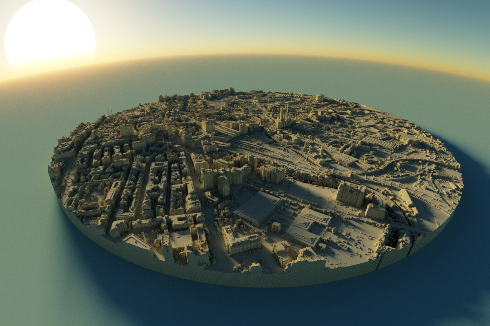
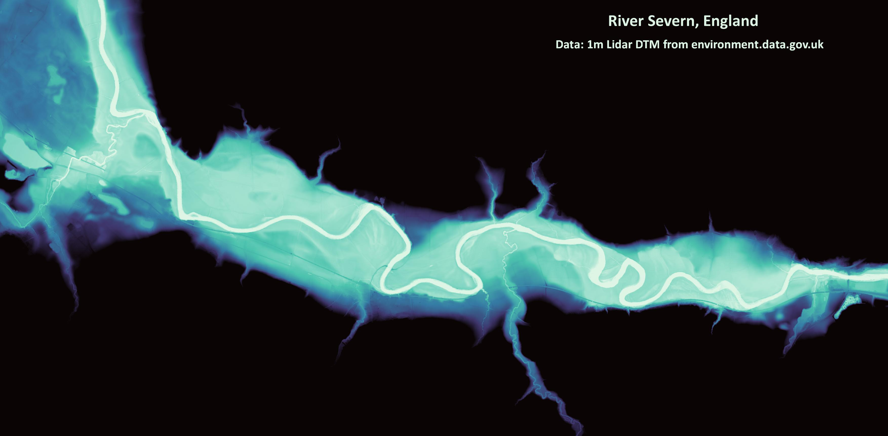

# Spatial Data Science, Water Resources, Climate Change
##Summary
Geospatial professional with expertise in spatial data science, focusing on water resources management and climate change.

## Education							       		
- M.S., River Basin Dynamics and GIS	| University of Leeds _2019_	 			        		
- B.S., Geography | University of Panama _2017_

## Work Experience
**Geospatial Analyst at Watermarq London (_Sept 2023 - Present_)**
Geospatial data acquisition and analysis on water demand and supply trends. 
- Conducted spatiotemporal data analysis of surface water availability and water demand trends.
- Developed new methods for water demand and supply accounting
- Carried out country-level water risk assessment to evaluate water availability risks in countries with significant mining operations.

**Associate Project Officer at World Meteorological Organization (_Oct 2021 - February 2023)**
- Coordinated and managed hydrological forecasting projects and capacity-building efforts to stregthen the capability of developing countries in operational hydrology, managing water resources, disaster risk reduction and fostering cooperation in transboundary watershed management.

**Ministry of Environment Panama (_March 2020 - Oct 2021)**
- Conducted modeling and spatial analysis of sea-level rise and climate change impacts, analyzed satellite imagery for forest emission assessments, and developed geodatabases to monitor climate data and vulnerability
# Map Portfolio
Below is a compilation of selected GIS mapping projects. 

## Banana Plantations in Changuinola, Panama

## Geneva city 3D

## Lake Geneva Bathymetry

## Canopy Height

## City of Leeds 3D

## Panama Population 3D

## Relative Elevation Model River Severn

## Colorful Panama Rivers

## Central America Rainfall animation

