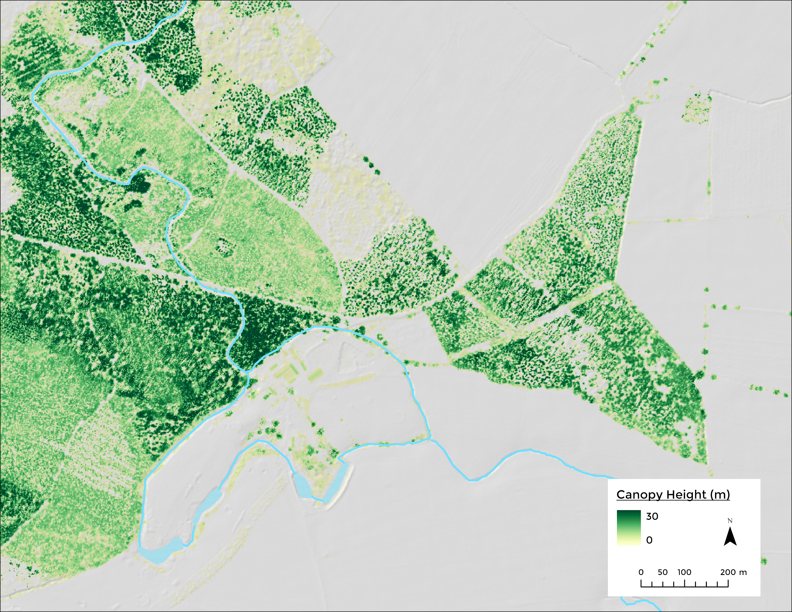
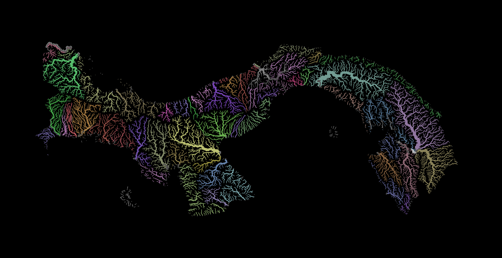

# Spatial Data Science, Water Resources, Climate Change
##Summary
I am a geospatial professional with expertise in spatial data acquisition and analysis, focusing on water resources management and climate change.

### Education
MSc River Basin Dynamics and GIS

### Work Experience
Watermarq

World Meteorological Organization

# Portfolio
Below is a compilation of selected GIS mapping projects over the past 5 years. 

## Lake Geneva Bathymetry

## Canopy Height

## City of Leeds 3D

## Panama Population 3D

## Relative Elevation Model River Severn

## Colorful Panama Rivers

