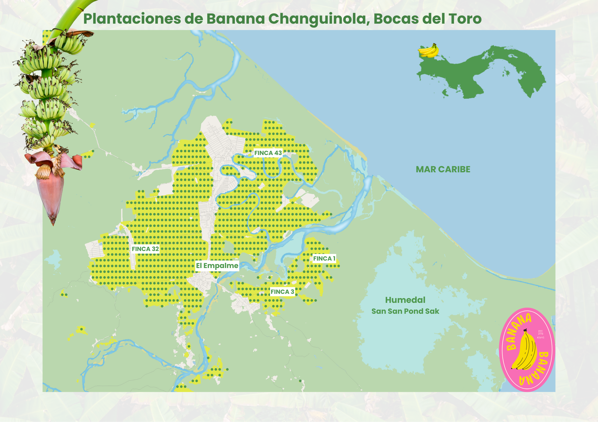
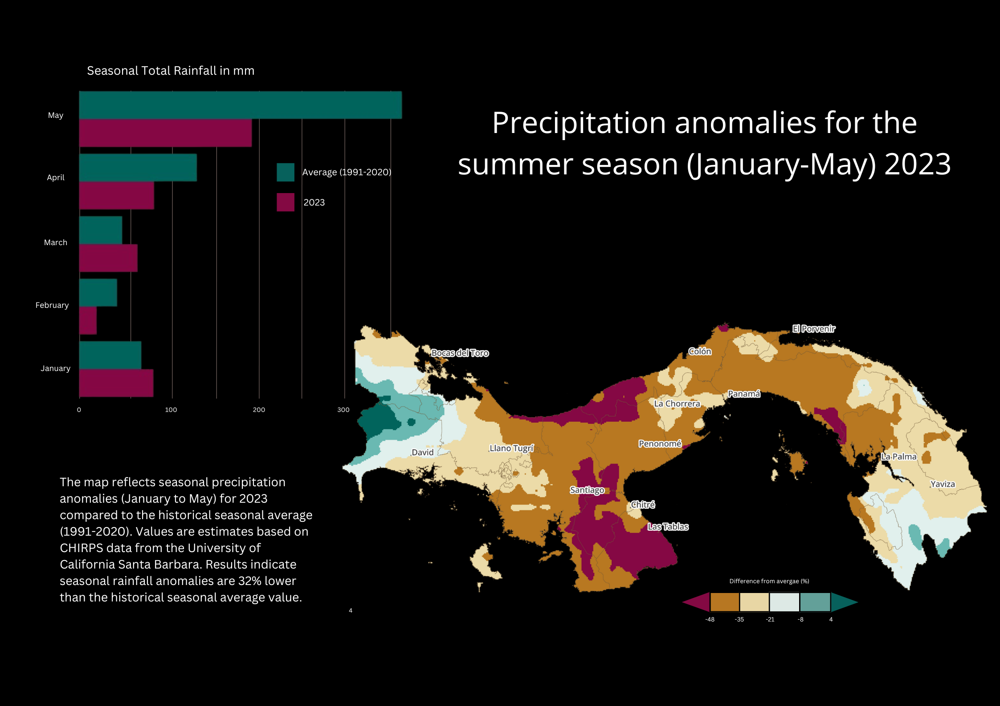
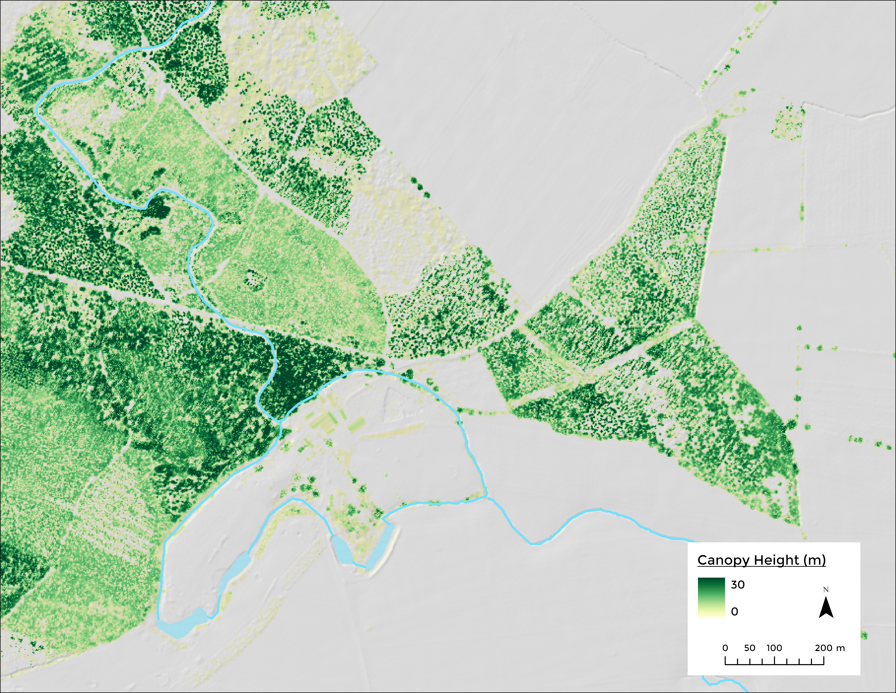
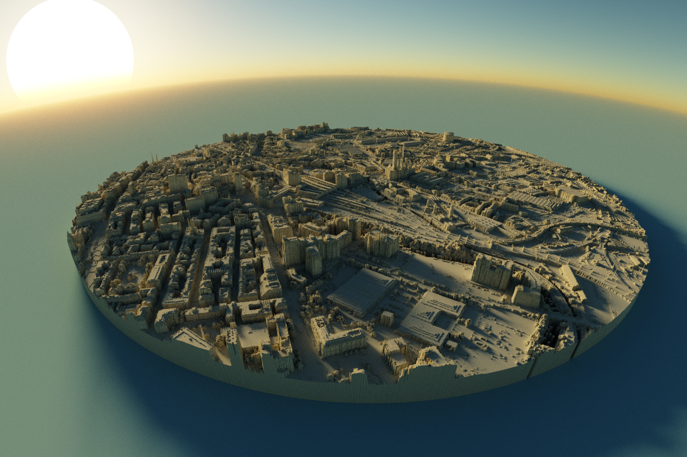
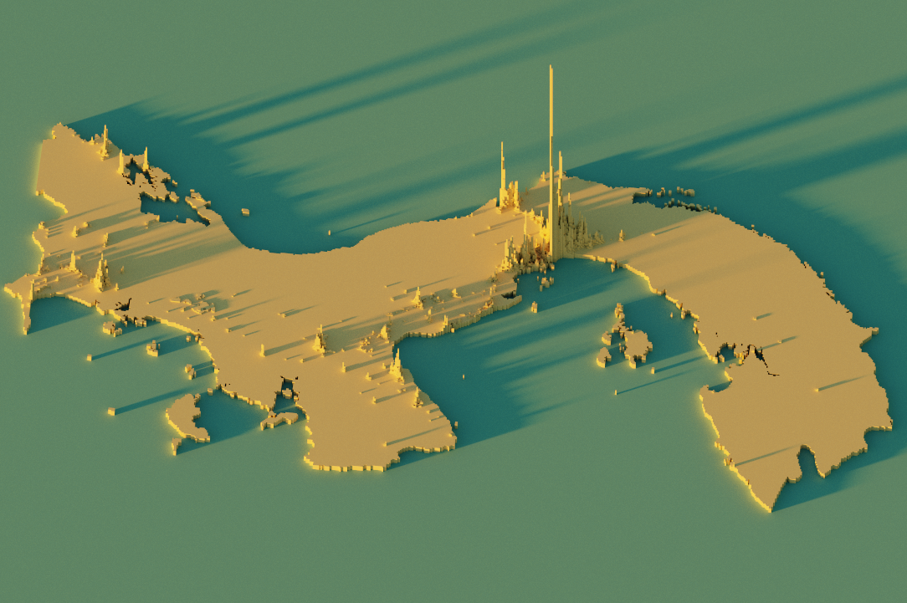
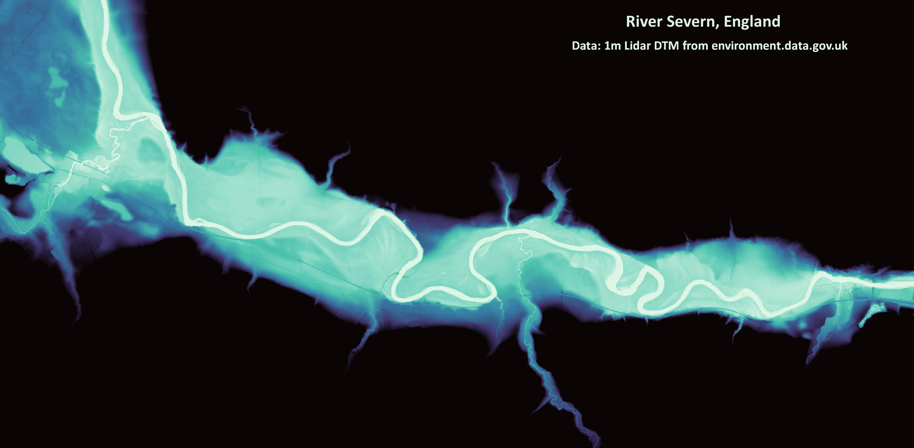
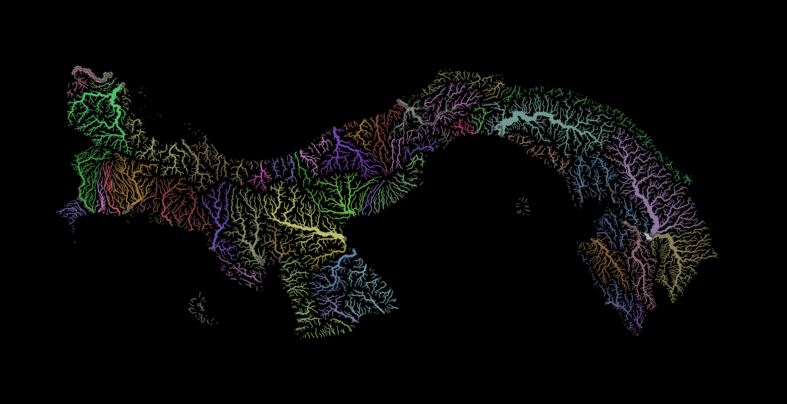
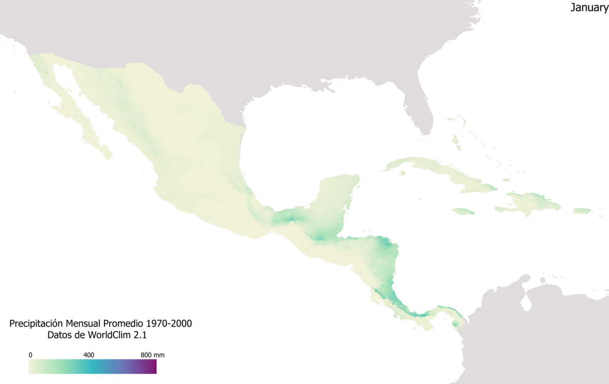

<head>
  <link rel="stylesheet" href="{{ '/assets/custom.css' | relative_url }}">
</head>

# Map Portfolio
Hi! 🌴

I am a Geographer with experience in spatial data science, specializing in water resources management and climate change.

I enjoy creating new maps to explore and highlight the geography of our world using creative techniques and vibrant colors. I’m also passionate about experimenting with new geospatial data and tools to bring visualizations to life in vivid ways. 

Below is a collection of selected GIS mapping projects 🌎

## Banana Plantations in Changuinola, Panama

## Geneva city 3D

## Summer Precipitation Anomalies in Panama, May 2023

## Lake Geneva Bathymetry

## Canopy Height

## City of Leeds 3D

## Panama Population 3D

## Relative Elevation Model River Severn

## Colorful Panama Rivers

## Central America Rainfall animation

